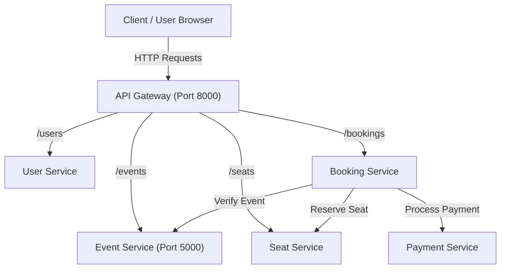

# Movie & Concert Ticket Booking System

A containerized, microservices-based ticket booking platform designed for movies and live concert events. This project demonstrates microservice design principles, RESTful inter-service communication, containerization with Docker, multi-container orchestration with Docker Compose, and performance benchmarking under varying load conditions.

---

## Table of Contents

- [Project Overview](#project-overview)
- [System Architecture](#system-architecture)
- [Microservices Breakdown](#microservices-breakdown)
- [Repository Structure](#repository-structure)
- [Service Specifications](#service-specifications)
  - [Event Service](#event-service)
  - [Upcoming Services](#upcoming-services)
- [Getting Started](#getting-started)
  - [Prerequisites](#prerequisites)
  - [Running Event Service (Locally)](#running-event-service-locally)
  - [Running Event Service (Docker)](#running-event-service-docker)
  - [Multi-Container Deployment (Docker Compose)](#multi-container-deployment-docker-compose)
- [API Testing & Verification](#api-testing--verification)
- [Load Testing & Performance Evaluation](#load-testing--performance-evaluation)
- [Project Roadmap](#project-roadmap)
- [Academic Context](#academic-context)

---

## Project Overview

The **Movie & Concert Ticket Booking System** decouples traditional monolithic ticketing operations into autonomous, loosely-coupled microservices. Each service encapsulates a distinct business domain with its own code, dependencies, and deployment lifecycle.

### Key Objectives:
- **Domain-Driven Isolation:** Independent microservices for Users, Events, Seats, Bookings, and Payments.
- **Containerization:** Each service packages its own runtime environment via lightweight Docker containers (`python:3.12-slim`).
- **Standardized REST Communication:** Clear HTTP/JSON contracts between gateway and services.
- **Scalability & Orchestration:** Orchestrated via Docker Compose with dedicated networking and service discovery.
- **Performance Evaluation:** Rigorous load testing using [Locust](https://locust.io/) and custom Python stress generators to evaluate latency, throughput, and stability.

---

## System Architecture

```text
                           +------------------+
                           |      Client      |
                           | (Web / Mobile)   |
                           +--------+---------+
                                    |
                                    | HTTP / REST
                                    v
                           +------------------+
                           |   API Gateway    |
                           |  (Reverse Proxy) |
                           +--------+---------+
                                    |
         +--------------------------+--------------------------+
         |                          |                          |
         v                          v                          v
  +--------------+           +--------------+           +--------------+
  | User Service |           | Event Service|           | Seat Service |
  | (Auth/Users) |           |  (Catalog)   |           | (Layout/Lock)|
  +--------------+           +------+-------+           +--------------+
                                    |
                                    v
                             +--------------+
                             |Booking Serv. |
                             | (Reservation)|
                             +------+-------+
                                    |
                                    v
                             +--------------+
                             | Payment Serv.|
                             | (Transaction)|
                             +--------------+
```



---

## Microservices Breakdown

| Service | Port | Description | Technology | Status |
| :--- | :---: | :--- | :--- | :---: |
| **API Gateway** | `8000` | Unified entry point, request routing, rate limiting | Reverse Proxy | *Planned* |
| **Event Service** | `5000` | Catalogs movies and concerts, venues, dates, and details | Python / Flask / Docker | **Active** |
| **User Service** | `5001` | User registration, authentication, and profile management | Python / Flask / Docker | *Planned* |
| **Seat Service** | `5002` | Seat layouts, availability tracking, and concurrency locks | Python / Flask / Docker | *Planned* |
| **Booking Service** | `5003` | Booking orchestration, reservations, and order history | Python / Flask / Docker | *Planned* |
| **Payment Service** | `5004` | Payment processing, transaction simulation, and receipts | Python / Flask / Docker | *Planned* |

---

## Repository Structure

```text
movie-concert-microservices/
├── api-gateway/               # API Gateway configuration and routing rules
├── architecture/              # Architecture diagrams, design docs, and workflows
├── docs/                      # Lab reports, assignment notes, and technical documentation
├── load-testing/              # Locust scripts (locustfile.py) and custom load generators
├── results/                   # Performance charts, latency logs, and benchmark summaries
├── services/
│   └── event-service/         # Event Catalog Microservice
│       ├── Dockerfile         # Container specification (python:3.12-slim)
│       ├── requirements.txt   # Service dependencies (Flask 3.1.2)
│       └── app.py             # Flask application code & REST endpoints
└── README.md                  # Project overview, documentation & setup guide
```

---

## Service Specifications

### Event Service

The **Event Service** is responsible for managing the catalog of entertainment events, including movies and concerts.

- **Base URL:** `http://localhost:5000`
- **Current Runtime:** Python 3.12 / Flask 3.1.2
- **Container Port:** `5000`

#### Available Endpoints:

| Method | Endpoint | Description | Sample Status |
| :--- | :--- | :--- | :---: |
| `GET` | `/` | Health check & service status | `200 OK` |
| `GET` | `/events` | Retrieve full list of movie & concert events | `200 OK` |
| `GET` | `/events/<id>` | Retrieve specific event details by ID | `200 OK` / `404 Not Found` |

#### Endpoint Details & Payloads:

##### 1. Health Check
```http
GET / HTTP/1.1
Host: localhost:5000
```
**Response (`200 OK`):**
```json
{
  "service": "Event Service",
  "status": "running"
}
```

##### 2. Get All Events
```http
GET /events HTTP/1.1
Host: localhost:5000
```
**Response (`200 OK`):**
```json
[
  {
    "id": 1,
    "name": "Avengers: Secret Wars",
    "type": "movie",
    "venue": "PVR Hubli",
    "date": "2026-10-05"
  },
  {
    "id": 2,
    "name": "Arijit Singh Live",
    "type": "concert",
    "venue": "Bengaluru",
    "date": "2026-10-10"
  }
]
```

##### 3. Get Event by ID
```http
GET /events/1 HTTP/1.1
Host: localhost:5000
```
**Response (`200 OK`):**
```json
{
  "id": 1,
  "name": "Avengers: Secret Wars",
  "type": "movie",
  "venue": "PVR Hubli",
  "date": "2026-10-05"
}
```
**Error Response (`404 Not Found` for invalid ID):**
```json
{
  "error": "Event not found"
}
```

---

## Getting Started

### Prerequisites
- [Git](https://git-scm.com/) installed
- [Python 3.10+](https://www.python.org/downloads/) installed (for local non-containerized execution)
- [Docker](https://www.docker.com/) & Docker Compose installed (for containerized execution)

---

### Running Event Service (Locally)

1. **Navigate to the event service directory:**
   ```bash
   cd services/event-service
   ```

2. **Create and activate a virtual environment:**
   - **Linux / macOS:**
     ```bash
     python3 -m venv venv
     source venv/bin/activate
     ```
   - **Windows (PowerShell):**
     ```powershell
     python -m venv venv
     .\venv\Scripts\Activate.ps1
     ```

3. **Install dependencies:**
   ```bash
   pip install -r requirements.txt
   ```

4. **Start the service:**
   ```bash
   python app.py
   ```
   The service will be accessible at: `http://localhost:5000`

---

### Running Event Service (Docker)

1. **Build the Docker image:**
   ```bash
   cd services/event-service
   docker build -t event-service:latest .
   ```

2. **Run the container:**
   ```bash
   docker run -d -p 5000:5000 --name event-service-container event-service:latest
   ```

3. **Verify running container:**
   ```bash
   docker ps
   ```

4. **Stop and remove container:**
   ```bash
   docker stop event-service-container
   docker rm event-service-container
   ```

---

### Multi-Container Deployment (Docker Compose)

Once the remaining services and API Gateway are containerized, the entire application stack can be provisioned simultaneously:

```bash
# From project root
docker compose up --build -d
```

To stop all services:
```bash
docker compose down
```

---

## API Testing & Verification

You can test the endpoints using `curl` or PowerShell:

### Using cURL:
```bash
# Service Health
curl -X GET http://localhost:5000/

# List All Events
curl -X GET http://localhost:5000/events

# Get Event by ID
curl -X GET http://localhost:5000/events/1

# Invalid Event (404 Test)
curl -X GET http://localhost:5000/events/99
```

### Using PowerShell:
```powershell
# Health check
Invoke-RestMethod -Uri "http://localhost:5000/" -Method Get

# Fetch all events
Invoke-RestMethod -Uri "http://localhost:5000/events" -Method Get

# Fetch event by ID
Invoke-RestMethod -Uri "http://localhost:5000/events/1" -Method Get
```

---

## Load Testing & Performance Evaluation

One of the core objectives of this project is evaluating microservices under varying concurrent workloads.

### Testing Tools:
1. **Locust (`load-testing/locustfile.py`):**
   - User behavior simulation (browsing events, selecting seats, initiating checkout).
   - Configurable user count, spawn rate, and run duration.
   - Real-time web UI metrics dashboard.
2. **Custom Python Load Generator (`load-testing/load_generator.py`):**
   - High-throughput asynchronous request generator (`asyncio` / `aiohttp`).
   - Stress testing specific endpoints for latency degradation and maximum concurrency limits.

### Evaluation Metrics:
- **Throughput:** Requests per second (RPS).
- **Latency Distribution:** Median, 90th, 95th, and 99th percentile response times (ms).
- **Failure Rate:** Error percentage under peak concurrency.
- **Resource Utilization:** CPU and memory consumption per container using `docker stats`.

*Benchmark results and graphs will be compiled and archived in the [`results/`](./results) directory.*

---

## Project Roadmap

- [x] **Milestone 1:** Architecture & domain modeling
- [x] **Milestone 2:** Implement & containerize **Event Service**
- [ ] **Milestone 3:** Implement **User Service** (Authentication & user registry)
- [ ] **Milestone 4:** Implement **Seat Service** (Seat layout & concurrency locking)
- [ ] **Milestone 5:** Implement **Booking Service** & **Payment Service**
- [ ] **Milestone 6:** Configure **API Gateway** & complete `docker-compose.yml`
- [ ] **Milestone 7:** Execute Locust load testing & generate performance benchmark report

---

## Academic Context

- **Course:** Cloud Computing Laboratory (CCLab) — Semester 5
- **Institution:** KLE Technological University
- **Focus:** Microservices Design Patterns, Containerization, Distributed Orchestration & Workload Benchmarking
