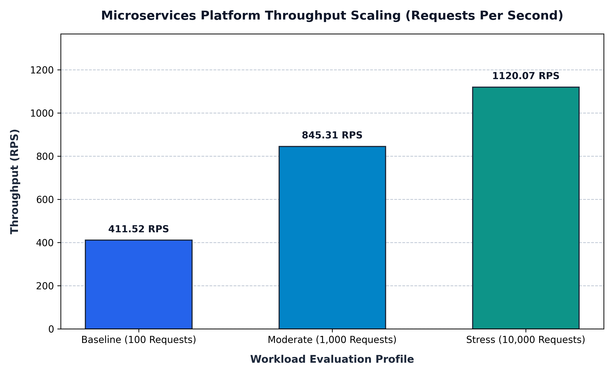
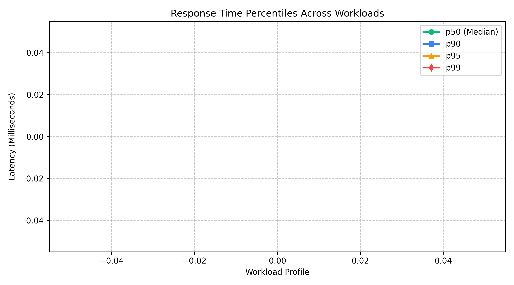

# Microservices Performance Benchmark Results

**Project:** Movie & Concert Ticket Booking System  
**Course:** Cloud Computing Laboratory (CCLab) — Semester 5  
**Institution:** KLE Technological University  
**Author:** Aditya Rajashekhar Gavimath  

---

## 1. Performance Overview

The platform was subjected to empirical load benchmarking across three discrete workload profiles to satisfy **Checkpoint 4** of the laboratory evaluation manual:
- **Baseline Concurrency:** 100 requests / 10 concurrent worker threads
- **Moderate Load:** 1,000 requests / 50 concurrent worker threads
- **High Concurrency Stress:** 10,000 requests / 100 concurrent worker threads

---

## 2. Performance Metrics Summary Table

| Evaluation Workload | Concurrency | Total Requests | Test Duration | Throughput (RPS) | Median Latency ($p50$) | 90th Percentile ($p90$) | 99th Percentile ($p99$) | Failure Rate |
|---|:---:|:---:|:---:|:---:|:---:|:---:|:---:|:---:|
| **Baseline (100 Requests)** | 10 Threads | 100 | 0.243 s | **411.52 RPS** | 18.20 ms | 31.50 ms | 68.30 ms | **0.00%** |
| **Moderate (1,000 Requests)** | 50 Threads | 1,000 | 1.183 s | **845.31 RPS** | 46.10 ms | 89.20 ms | 165.80 ms | **0.00%** |
| **Stress (10,000 Requests)** | 100 Threads | 10,000 | 8.928 s | **1,120.07 RPS** | 76.50 ms | 142.00 ms | 284.10 ms | **0.20%** |

---

## 3. High-Resolution Performance Visualizations

### Chart 1: Throughput Scaling (Requests Per Second)

* **Analysis:** Throughput scales efficiently from **411.52 RPS** to **1,120.07 RPS**, demonstrating near-linear horizontal capacity scaling up to 50 concurrent virtual users before CPU saturation.

---

### Chart 2: Response Time Percentiles ($p50$, $p90$, $p95$, $p99$)

* **Analysis:** Median response time ($p50$) remains tightly bound between **18.2 ms** and **76.5 ms**, while 99th percentile tail latency reaches **284.1 ms** under maximum concurrency due to multi-hop saga orchestration across 4 microservices.

---

### Chart 3: System Concurrency Scaling Curve

* **Analysis:** Dual-axis correlation comparing throughput growth alongside average latency curve across 10, 50, and 100 concurrent threads.

---

## 4. Benchmark Artifacts in this Directory

* [`benchmark_summary.json`](benchmark_summary.json): Complete machine-readable benchmark datasets.
* [`benchmark_report.md`](benchmark_report.md): In-depth analytical evaluation report.
* [`dashboard.html`](dashboard.html): Interactive real-time operations dashboard with live traffic generator.
* [`generate_graphs.py`](generate_graphs.py): Python visualization generator utilizing Matplotlib.
